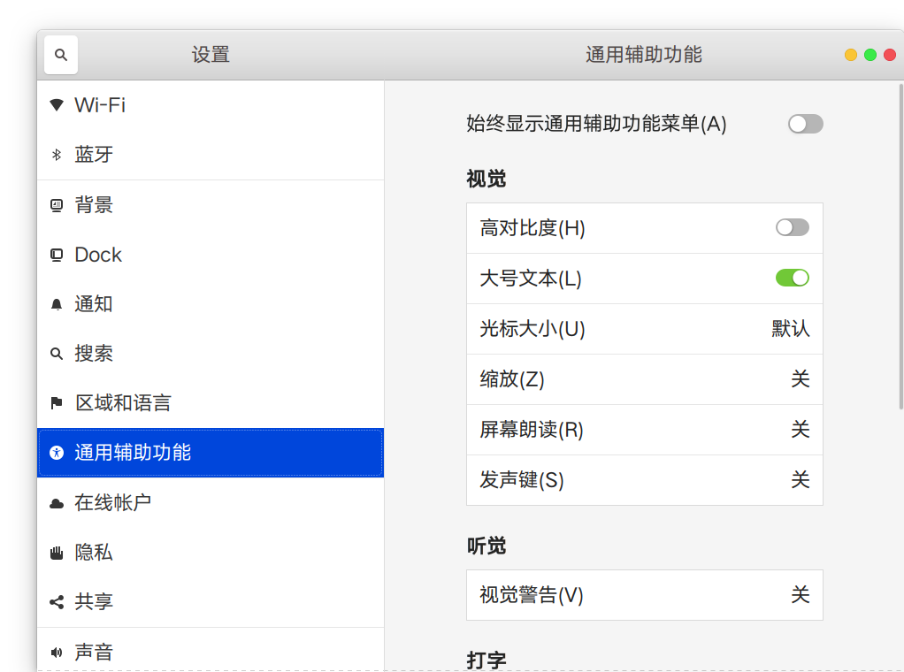
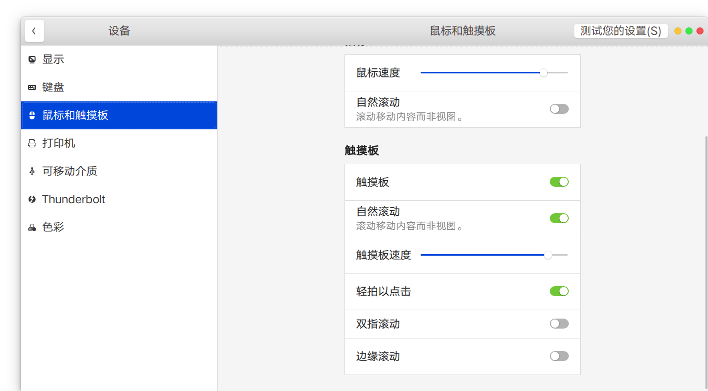
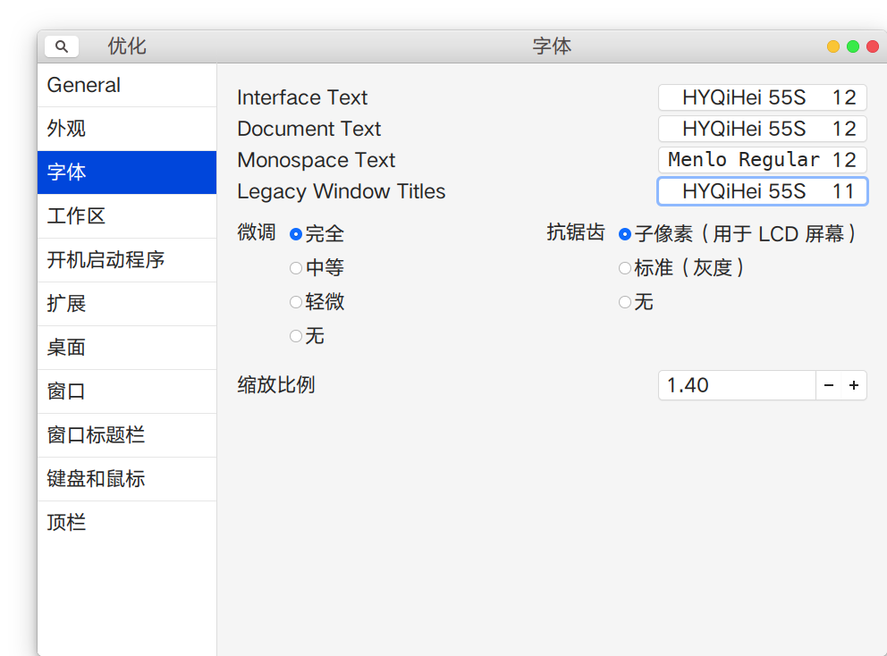
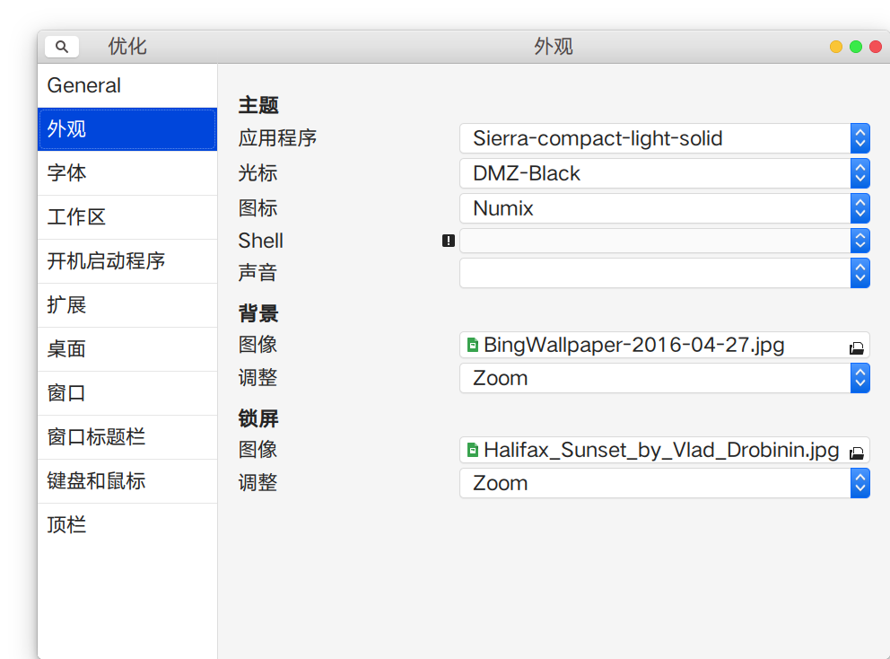

### 电脑型号

XPS13 9350

### Linux发行版

Ubuntu 18.10

### 更新源配置

/etc/apt/sources.list :

```shell
deb http://mirrors.ustc.edu.cn/ubuntu/ cosmic main restricted universe multiverse
deb http://mirrors.ustc.edu.cn/ubuntu/ cosmic-updates main restricted universe multiverse
deb http://mirrors.ustc.edu.cn/ubuntu/ cosmic-proposed main restricted universe multiverse
deb http://mirrors.ustc.edu.cn/ubuntu/ cosmic-backports main restricted universe multiverse
deb http://mirrors.ustc.edu.cn/ubuntu/ cosmic-security main restricted universe multiverse
```
/etc/apt/sources.list.d/* :

	# deb https://apt.dockerproject.org/repo ubuntu-wily main
	# deb [arch=amd64] http://dl.google.com/linux/chrome/deb/ stable main
	# deb http://ppa.launchpad.net/hzwhuang/ss-qt5/ubuntu wily main
	# deb https://download.01.org/gfx/ubuntu/16.10/main yakkety main #Intel Graphics drivers
	# deb http://ppa.launchpad.net/moka/daily/ubuntu bionic main
	# deb http://ppa.launchpad.net/nathan-renniewaldock/flux/ubuntu bionic main
	#deb http://ppa.launchpad.net/numix/ppa/ubuntu cosmic main
	# deb http://repo.percona.com/apt yakkety main
	# deb http://repo.percona.com/apt xenial testing
	# deb http://repo.percona.com/apt xenial experimental
	#deb http://repo.percona.com/apt yakkety main
	#deb http://repo.percona.com/apt yakkety testing
	#deb http://repo.percona.com/apt yakkety experimental
	# deb http://ppa.launchpad.net/snwh/pulp/ubuntu zesty main
	#deb http://archive.ubuntukylin.com:10006/ubuntukylin bionic main
	# deb [arch=amd64] http://packages.microsoft.com/repos/vscode stable main
	# deb http://ppa.launchpad.net/webupd8team/java/ubuntu wily main
### Gnome桌面配置

系统设置里设置大号文本:

配置鼠标和触摸板：




使用gnome-tweak-tool配置字体和缩放比例:



安装sierra主题和numix图标，并使用gnome-tweak-tool应用主题和图标：



### 命令行配置

##### ~/.bashrc配置
详见文件[bashrc](./bashrc)：

```shell
# 配置终端提示符颜色：
if [ "$color_prompt" = yes ]; then
#    PS1='${debian_chroot:+($debian_chroot)}\[\033[01;32m\]\u@\h\[\033[00m\]:\[\033[01;34m\]\w\[\033[00m\]\$ '
    PS1='${debian_chroot:+($debian_chroot)}\[\033[01;35m\]\u@\h:\[\033[00m\]\w\$ '
else
    PS1='${debian_chroot:+($debian_chroot)}\u@\h:\w\$ '
fi

# 彩色man命令
man() {
    env LESS_TERMCAP_mb=$'\E[01;31m' \
    LESS_TERMCAP_md=$'\E[01;38;5;74m' \
    LESS_TERMCAP_me=$'\E[0m' \
    LESS_TERMCAP_se=$'\E[0m' \
    LESS_TERMCAP_so=$'\E[38;5;246m' \
    LESS_TERMCAP_ue=$'\E[0m' \
    LESS_TERMCAP_us=$'\E[04;38;5;146m' \
    man "$@"
}

# 一些快捷键
alias c='printf "\033c"'
alias ..="cd .."
alias ....="cd ../.."
alias ls='ls --color=auto -F'
alias su='sudo su'
alias psc='ps xawf -eo pid,user,cgroup,args'
alias cnf='command-not-found'
alias cp='cp -i'
alias rm='rm -i'
alias mv='mv -i'
alias aptup='sudo apt update;sudo apt upgrade'
alias mycli='mycli -uroot'
alias apt='/usr/bin/apt'
alias tailf='tail -f'
alias genpasswd="strings /dev/urandom | grep -o '[[:alnum:]]' | head -n 30 | tr -d '\n'; echo"

# 开发环境
# java
export JAVA_HOME=/opt/jdk
export PATH=$JAVA_HOME/bin:$PATH
export CLASSPATH=.:$JAVA_HOME/lib/dt.jar:$JAVA_HOME/lib/tools.jar
#golang
export GOROOT=/opt/go
export GOBIN=$HOME/go/bin
export GOPATH=$HOME/go/3rd:$HOME/go
export PATH=$PATH:$GOROOT/bin:$GOBIN:
# c & c++
#alias gcc='gcc -fdiagnostics-color=auto'
#alias g++='g++ -fdiagnostics-color=auto'
alias clang-format='clang-format-3.5'
alias cformat='clang-format-3.5 -style="{BasedOnStyle: llvm, IndentWidth: 4}" -i'

```
##### 其他profile配置：

```bash
$ ls /etc/profile.d/
01-locale-fix.sh  bash_completion.sh     gawk.csh  input-method-config.sh  vte.sh
apps-bin-path.sh  cedilla-portuguese.sh  gawk.sh   vte-2.91.sh             xdg_dirs_desktop_session.sh
```

```bash
$ ls /etc/bash_completion.d/
apport_completion  cheat.bash  cpack  desktop-file-validate  docker      insserv  openvpn
apt-show-versions  cmake       ctest  dkms                   git-prompt  maven
pulseaudio
```

##### ~/.vimrc配置

详见文件[vimrc](./vimrc)。

### 应用软件

[Chrome](https://dl.google.com/linux/direct/google-chrome-stable_current_amd64.deb) 浏览器

[Sublime Text](https://www.sublimetext.com/) 文本编辑器

[Typora](https://www.typora.io/linux/Packages) 一个markdown编辑器

[SogouPinyin](https://pinyin.sogou.com/linux/?r=pinyin) 中文输入法

Thunderbird 邮件客户端
