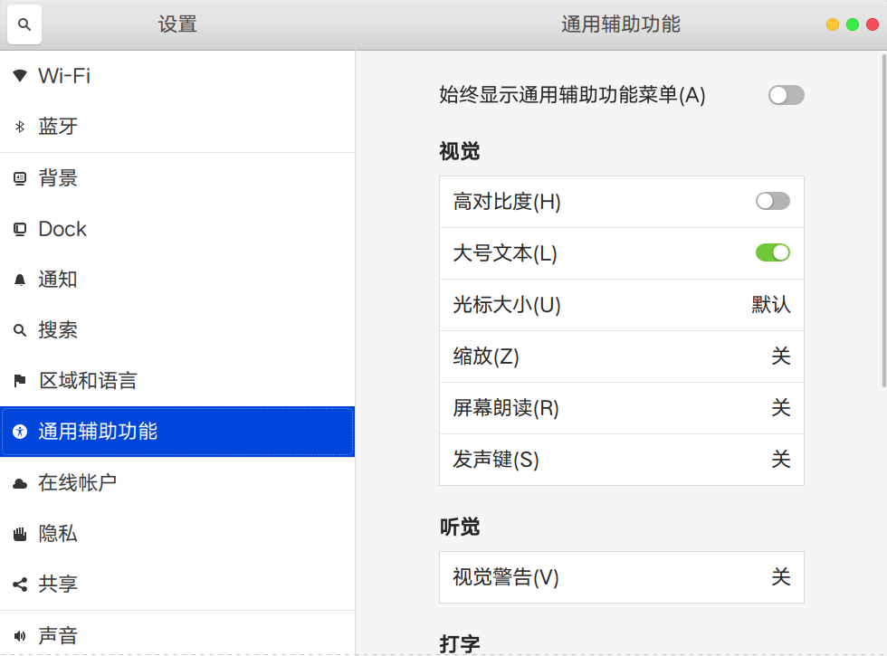
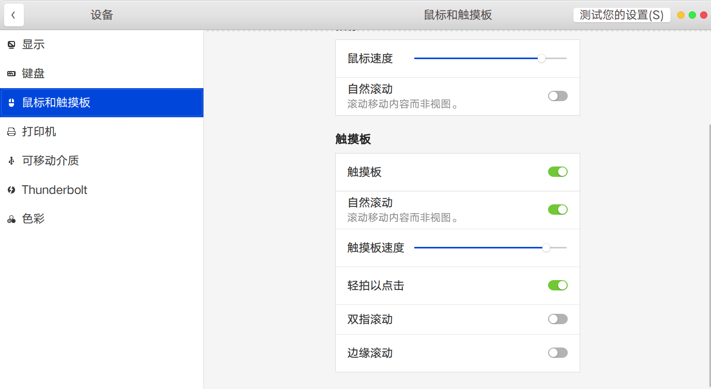
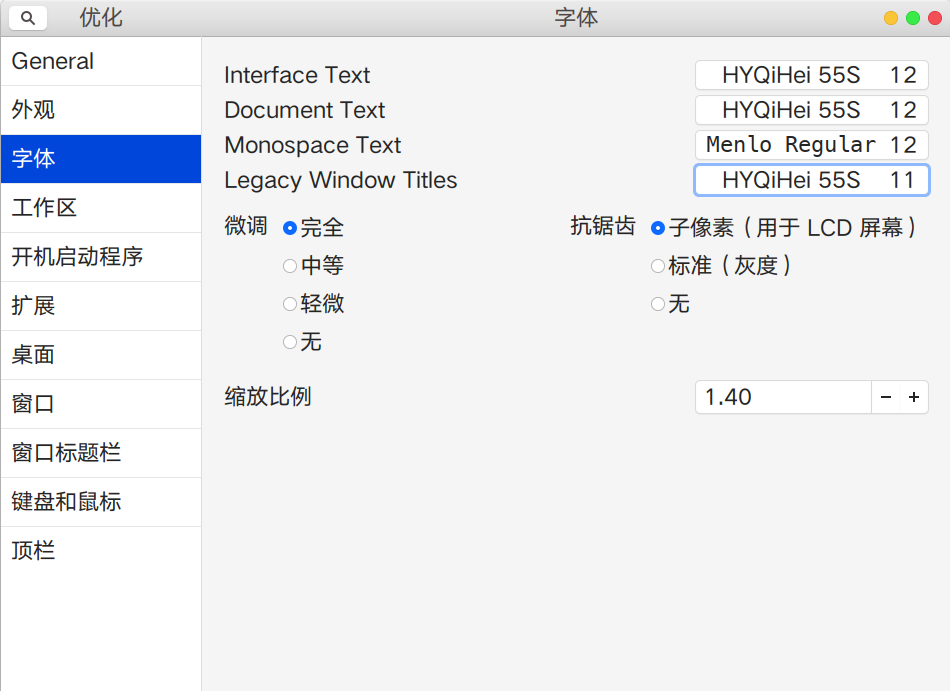
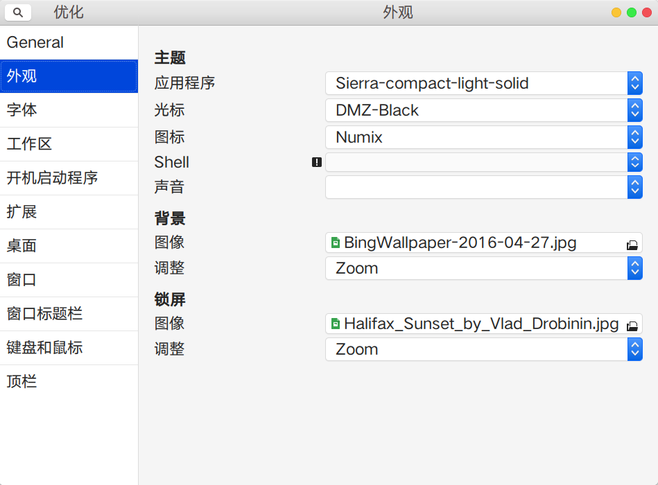

# Linux环境配置

### 设备

电脑型号：      XPS13 9350

Linux发行版：Ubuntu 18.10

### 命令行配置

##### ~/.vimrc配置

详见文件[vimrc](./vimrc)。

##### ~/.bashrc配置

详见文件[bashrc](./bashrc)。

##### 其他profile配置

```bash
$ ls /etc/profile.d/
01-locale-fix.sh  bash_completion.sh     gawk.csh  input-method-config.sh  vte.sh
apps-bin-path.sh  cedilla-portuguese.sh  gawk.sh   vte-2.91.sh             xdg_dirs_desktop_session.sh
```

```bash
$ ls /etc/bash_completion.d/
apport_completion  cheat.bash  cpack  desktop-file-validate  docker      insserv  openvpn
apt-show-versions  cmake       ctest  dkms                   git-prompt  maven
pulseaudio
```

### 更新源配置

详见文件：[sources.list](./sources.list)

### 应用软件

| 功能           | 软件名称                                                     |
| -------------- | ------------------------------------------------------------ |
| 浏览器         | [Chrome](https://dl.google.com/linux/direct/google-chrome-stable_current_amd64.deb) |
| 文本编辑器     | [Sublime Text](https://www.sublimetext.com/)                 |
| markdown编辑器 | [Typora](https://www.typora.io/linux/Packages)               |
| 中文输入法     | [SogouPinyin](https://pinyin.sogou.com/linux/?r=pinyin)      |
| 邮件客户端     | Thunderbird                                                  |

### Gnome桌面配置

系统设置里设置大号文本:

配置鼠标和触摸板：




使用gnome-tweak-tool配置字体和缩放比例:



安装sierra主题和numix图标，并使用gnome-tweak-tool应用主题和图标：




